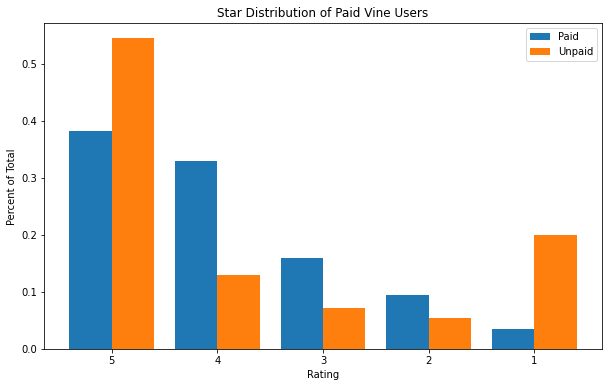

```python
## Dependencies
import pandas as pd
import numpy as np
import nbconvert
import matplotlib.pyplot as plt
import scipy.stats as stats
from scipy.stats import ks_2samp
```


```python
## Read file
filename = "C:/Users/justi/OneDrive/Desktop/Analytics/Amazon_Vine_Analysis/vine_table.csv"
vine_table = pd.read_csv(filename)
```


```python
vine_table.head()
```


<div>
<style scoped>
    .dataframe tbody tr th:only-of-type {
        vertical-align: middle;
    }

    .dataframe tbody tr th {
        vertical-align: top;
    }

    .dataframe thead th {
        text-align: right;
    }
</style>
<table border="1" class="dataframe">
  <thead>
    <tr style="text-align: right;">
      <th></th>
      <th>review_id</th>
      <th>star_rating</th>
      <th>helpful_votes</th>
      <th>total_votes</th>
      <th>vine</th>
      <th>verified_purchase</th>
    </tr>
  </thead>
  <tbody>
    <tr>
      <th>0</th>
      <td>REAKC26P07MDN</td>
      <td>5</td>
      <td>0</td>
      <td>0</td>
      <td>N</td>
      <td>Y</td>
    </tr>
    <tr>
      <th>1</th>
      <td>R3NU7OMZ4HQIEG</td>
      <td>2</td>
      <td>0</td>
      <td>1</td>
      <td>N</td>
      <td>Y</td>
    </tr>
    <tr>
      <th>2</th>
      <td>R14QJW3XF8QO1P</td>
      <td>5</td>
      <td>0</td>
      <td>0</td>
      <td>N</td>
      <td>Y</td>
    </tr>
    <tr>
      <th>3</th>
      <td>R2HB7AX0394ZGY</td>
      <td>5</td>
      <td>0</td>
      <td>0</td>
      <td>N</td>
      <td>Y</td>
    </tr>
    <tr>
      <th>4</th>
      <td>RGKMPDQGSAHR3</td>
      <td>5</td>
      <td>0</td>
      <td>0</td>
      <td>N</td>
      <td>Y</td>
    </tr>
  </tbody>
</table>
</div>


```python
# First filter for 20 or more votes
vine_df = vine_table[vine_table.total_votes >= 20]
vine_df.head()
```


<div>
<style scoped>
    .dataframe tbody tr th:only-of-type {
        vertical-align: middle;
    }

    .dataframe tbody tr th {
        vertical-align: top;
    }

    .dataframe thead th {
        text-align: right;
    }
</style>
<table border="1" class="dataframe">
  <thead>
    <tr style="text-align: right;">
      <th></th>
      <th>review_id</th>
      <th>star_rating</th>
      <th>helpful_votes</th>
      <th>total_votes</th>
      <th>vine</th>
      <th>verified_purchase</th>
    </tr>
  </thead>
  <tbody>
    <tr>
      <th>128</th>
      <td>R21KC552Y6HL8X</td>
      <td>1</td>
      <td>27</td>
      <td>31</td>
      <td>N</td>
      <td>Y</td>
    </tr>
    <tr>
      <th>161</th>
      <td>RX9WC9FTIR1XR</td>
      <td>5</td>
      <td>25</td>
      <td>25</td>
      <td>N</td>
      <td>Y</td>
    </tr>
    <tr>
      <th>256</th>
      <td>RGDCOU1KBHMNG</td>
      <td>3</td>
      <td>29</td>
      <td>31</td>
      <td>N</td>
      <td>Y</td>
    </tr>
    <tr>
      <th>267</th>
      <td>RVTYWID2TPMMY</td>
      <td>2</td>
      <td>35</td>
      <td>42</td>
      <td>N</td>
      <td>Y</td>
    </tr>
    <tr>
      <th>719</th>
      <td>R2CMPZ5VESGRLY</td>
      <td>4</td>
      <td>27</td>
      <td>28</td>
      <td>N</td>
      <td>Y</td>
    </tr>
  </tbody>
</table>
</div>


```python
# Second filter to find products where helpful votes are at least 50% of total
helpful = vine_df[(vine_df.helpful_votes/vine_df.total_votes) >= 0.5]
```


```python
# Filter the data into 2 dfs with paid vine users and unpaid users
paid = helpful[helpful.vine == 'Y']
unpaid = helpful[helpful.vine == 'N']
```


```python
# Create a function that can return the total number of reviews, number of 5-star reviews and percentage of 5-star reviews for users
def calculate_reviews(df, rating=5, helpful='helpful'):
    total = df.review_id.count()
    fives = df.star_rating[df.star_rating == rating].count()
    percent = fives/total * 100
    
    if df.iloc[0,4] == "N":
        payment = "unpaid"
    else:
        payment = "paid vine"
     

    return (f'Out of {total:,} reviews, there were {fives:,} {rating}-star reviews. The percent of {helpful} 5-star reviews by {payment} users was {percent:.2f}%')
```


```python
# Display the vine users for pet products
calculate_reviews(paid)
```


    'Out of 170 reviews, there were 65 5-star reviews. The percent of helpful 5-star reviews by paid vine users was 38.24%'


```python
# Display the unpaid users for pet products
calculate_reviews(unpaid)
```


    'Out of 37,823 reviews, there were 20,605 5-star reviews. The percent of helpful 5-star reviews by unpaid users was 54.48%'


```python
# Further Analysis
# unhelpful reviewers
unhelpful = vine_df[(vine_df.helpful_votes/vine_df.total_votes) < 0.5]
u_paid = unhelpful[unhelpful.vine == 'Y']
u_unpaid = unhelpful[unhelpful.vine == 'N']
(calculate_reviews(u_paid, helpful='unhelpful'),
 calculate_reviews(u_unpaid, helpful='unhelpful'))
```


    ('Out of 2 reviews, there were 0 5-star reviews. The percent of unhelpful 5-star reviews by paid vine users was 0.00%',
     'Out of 1,364 reviews, there were 120 5-star reviews. The percent of unhelpful 5-star reviews by unpaid users was 8.80%')


```python
# Further Analysis
# Helpful 4-star
(calculate_reviews(paid, 4), calculate_reviews(unpaid, 4))
```


    ('Out of 170 reviews, there were 56 4-star reviews. The percent of helpful 5-star reviews by paid vine users was 32.94%',
     'Out of 37,823 reviews, there were 4,897 4-star reviews. The percent of helpful 5-star reviews by unpaid users was 12.95%')


```python
# Helpful 3-star
(calculate_reviews(paid, 3), calculate_reviews(unpaid, 3))
```


    ('Out of 170 reviews, there were 27 3-star reviews. The percent of helpful 5-star reviews by paid vine users was 15.88%',
     'Out of 37,823 reviews, there were 2,710 3-star reviews. The percent of helpful 5-star reviews by unpaid users was 7.16%')


```python
# Helpful 2-star
(calculate_reviews(paid, 2), calculate_reviews(unpaid, 2))
```


    ('Out of 170 reviews, there were 16 2-star reviews. The percent of helpful 5-star reviews by paid vine users was 9.41%',
     'Out of 37,823 reviews, there were 2,048 2-star reviews. The percent of helpful 5-star reviews by unpaid users was 5.41%')


```python
# Helpful 1-star
(calculate_reviews(paid, 1), calculate_reviews(unpaid, 1))
```


    ('Out of 170 reviews, there were 6 1-star reviews. The percent of helpful 5-star reviews by paid vine users was 3.53%',
     'Out of 37,823 reviews, there were 7,563 1-star reviews. The percent of helpful 5-star reviews by unpaid users was 20.00%')


```python
def distribute_reviews(df, helpful='helpful'):
    total = df.review_id.count()
    fives = df.star_rating[df.star_rating == 5].count()
    fours = df.star_rating[df.star_rating == 4].count()
    threes = df.star_rating[df.star_rating == 3].count()
    twos = df.star_rating[df.star_rating == 2].count()
    ones = df.star_rating[df.star_rating == 1].count()

    return [fives/total, fours/total, threes/total, twos/total, ones/total]
```


```python
paid_dist = distribute_reviews(paid)
unpaid_dist = distribute_reviews(unpaid)
x_labels = ["5", "4", "3", "2", "1"]
```


```python
plt.subplots(figsize=(10,6))

x_axis = np.arange(len(x_labels))
plt.bar(x_axis + 0.8, paid_dist, 0.4, label = "Paid")
plt.bar(x_axis + 1.2, unpaid_dist, 0.4, label = "Unpaid")

plt.title("Star Distribution of Paid Vine Users")
plt.xlabel("Rating")
plt.xticks([1, 2, 3, 4, 5], x_labels)
plt.ylabel("Percent of Total")
plt.legend()
plt.show()
```


    

    


```python
# Performing a Kolmogorov-Smirnov Test
# The KS Test shows the equality of continuous or discontinuous 1-D probability distributions to compare (in this case) 2 samples, answering whether 2 samples could have come from the same data distribution. 
ks_2samp(paid_dist, unpaid_dist)
```


    KstestResult(statistic=0.2, pvalue=1.0)


```python
paid_dist = distribute_reviews(u_paid)
unpaid_dist = distribute_reviews(u_unpaid)
x_labels = ["5", "4", "3", "2", "1"]

```


```python
plt.subplots(figsize=(10, 6))

x_axis = np.arange(len(x_labels))
plt.bar(x_axis + 1, unpaid_dist, 0.4, label="Unpaid")

plt.title("Star Distribution of Paid Vine Users")
plt.xlabel("Rating")
plt.xticks([1, 2, 3, 4, 5], x_labels)
plt.ylabel("Percent of Total")
plt.legend()
plt.show()

```


    

    


```python
# Unhelpful 1-star reviews
# Helpful 1-star
(calculate_reviews(u_paid, 1, helpful="unhelpful"),
 calculate_reviews(u_unpaid, 1, helpful="unhelpful"))

```


    ('Out of 2 reviews, there were 2 1-star reviews. The percent of unhelpful 5-star reviews by paid vine users was 100.00%',
     'Out of 1,364 reviews, there were 1,010 1-star reviews. The percent of unhelpful 5-star reviews by unpaid users was 74.05%')


